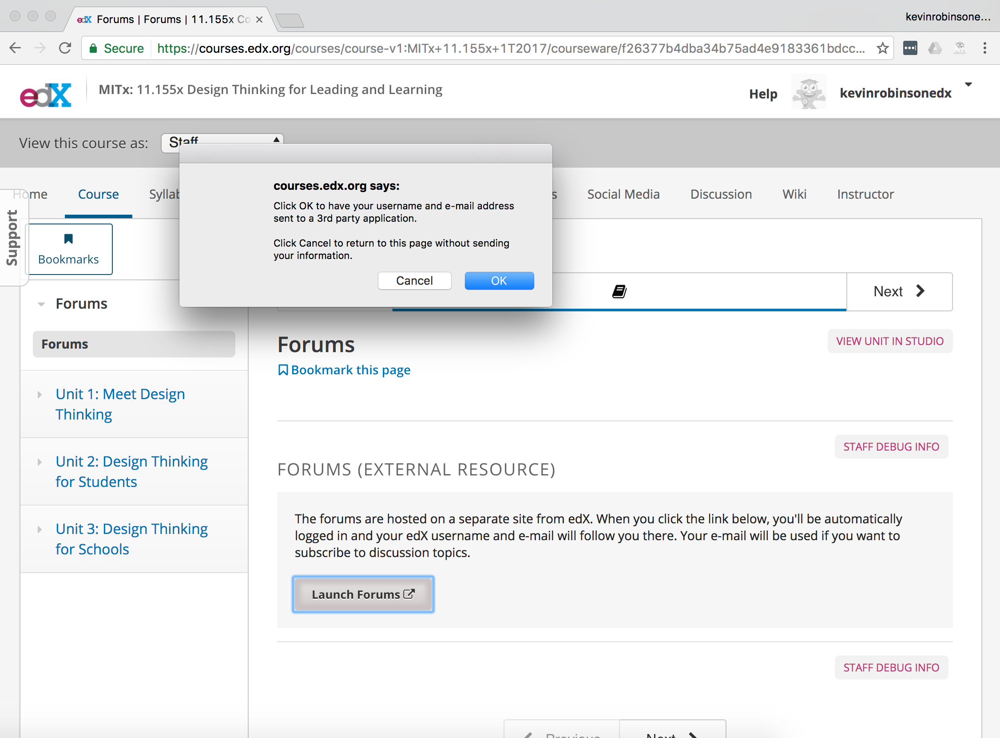
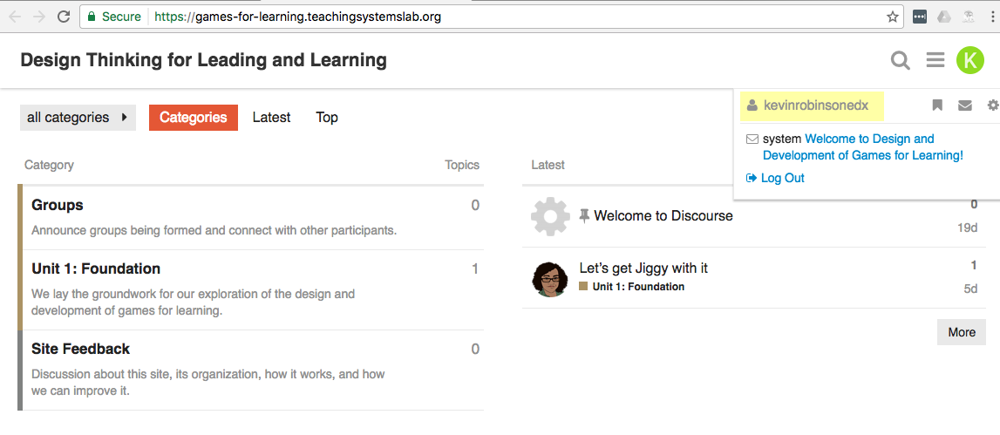
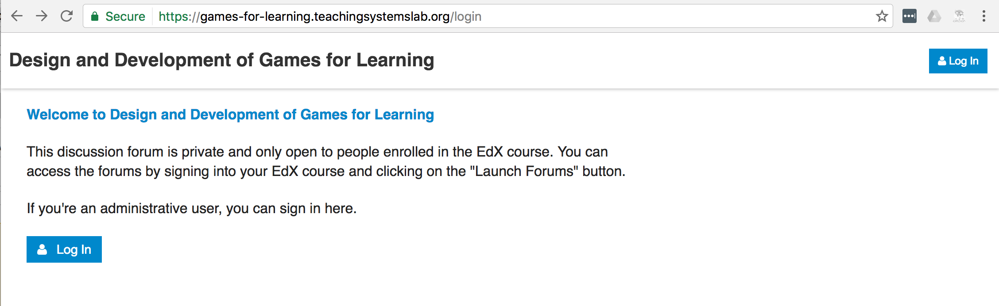

# discourse-edx-lti
This is a [Discourse](http://www.discourse.org/) plugin for using Discourse as a discussion forum in EdX courses.

It adds a Discourse `AuthProvider` that handles LTI authentication from EdX.  This allows one-click navigation from an EdX course into the discussion forum.  The login dialog also allows users to bounce back to the course, and Discourse admin users can sign in directly.

## User experience
#### 1. Learner signs into EdX


#### 2. Within EdX course, learner launches Discourse with LTI


#### 3. The learner is authenticated with their EdX username


#### 4. The Discourse instance is private


#### 5. Login button links back to EdX course or allows admin login


## Initial setup for new course forums
- Follow [Install Discourse in under 30 minutes](https://blog.discourse.org/2014/04/install-discourse-in-under-30-minutes/) (or deploy on your own setup)
- Setup [MailGun](https://www.mailgun.com/) or another email provider
- Add DNS records for email and for your new Discourse instance
- Test!

## Add SSL
- Setup SSL with Let's Encrypt ([instructions](https://meta.discourse.org/t/setting-up-lets-encrypt/40709))
- Rebuild container
- Test!

## Install and setup this plugin
- Install this repository as a Discourse plugin ([instructions](https://meta.discourse.org/t/install-a-plugin/19157))
- Rebuild container
- Test!
- (You should see a 'Login with EdX' button on the Login page, but it won't work yet)

##### Discourse login setup
- The intent is that the site is private, and learners can only gain access by signing in through EdX and launching the site through LTI.
- Admin users sign into Discourse directly.
- In the Discourse Admin UI, set:
  - `invite only`: true
  - `login required`: true
  - `must approve users`: false (default)
  - `enable local logins`: true (default)
  - `allow new registrations`: true (default)
  - `email editable`: false

##### Discourse plugin setup
- Pick an id for the forum site, generate a consumer key and secret
- In Discourse, visit `Admin` -> `Plugins` -> `discourse-edx-lti`
- Set the LTI consumer key and secret, and the EdX course URL

##### EdX course setup
- In EdX Studio, visit `Advanced settings`
- Add "lti" and "lti_consumer" to `Advanced Module List`
- Add the forum site's id, consumer key and consumer secret to `LTI Passports`
- In Studio, to link to the forum site add an LTI consumer that links to `/auth/lti/callback` on the forum site, and make sure to set "Request users' username" and "Request user's email" to `true`

## Set up your Discourse forums
- Close the forums unless you want coursework to be public
- Invite any other admin users
- Whatever else you like!


## Local development
You can develop with Vagrant ([see Discourse docs](https://github.com/discourse/discourse/blob/master/docs/VAGRANT.md)).  As you develop, clear the ERB cache, copy this repository to the `plugins` folder and restart Rails to see changes.

Example:
```
rm -rf tmp/cache && \
rm -rf ./plugins/discourse-edx-lti/ && \
rsync -av --exclude .git \
  ~/github/mit-teaching-systems-lab/discourse-edx-lti \
  ./plugins/ && \
vagrant ssh -c 'cd /vagrant && bundle exec rails s -b 0.0.0.0'
```

The `plugin-third-party.js.erb` file is what ultimately injects the JavaScript needed to show the new login button in the UI.  In development mode, this file will be cached and won't updated if you are rebuilding the plugin on each change.  You can touch it manually or just clear the ERB cache on each change (like above).  See https://meta.discourse.org/t/tmp-cache-needs-to-be-manually-cleared-when-developing-plugins/17109 or https://github.com/sstephenson/sprockets/issues/563 for other alternatives.