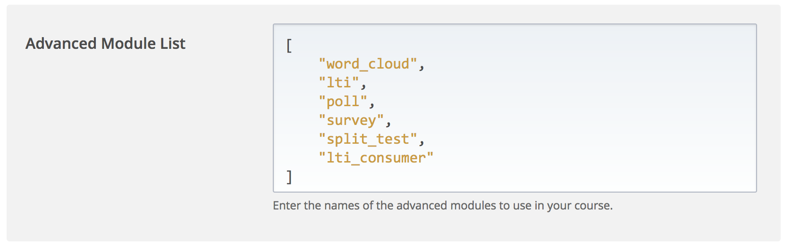
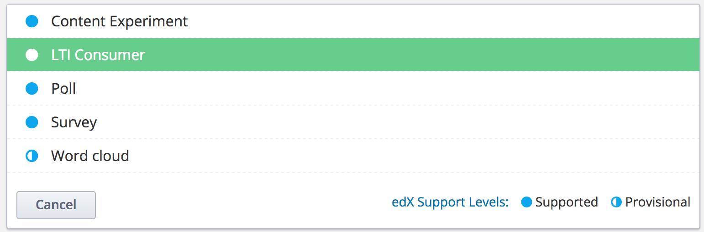
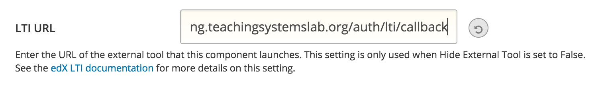
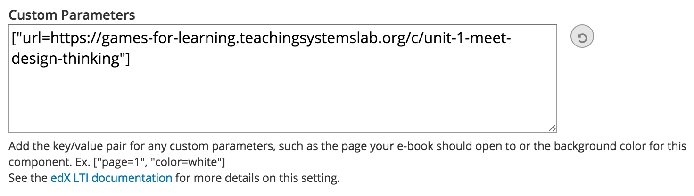
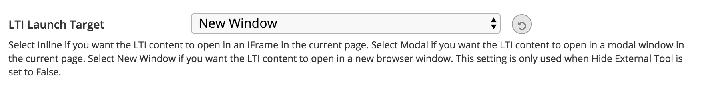

# discourse-edx-lti
This is a [Discourse](http://www.discourse.org/) plugin for using Discourse as a discussion forum in EdX courses.

It adds a Discourse `AuthProvider` that handles LTI authentication from EdX.  This allows one-click navigation from an EdX course into the discussion forum.  The login dialog also allows users to bounce back to the course, and Discourse admin users can sign in directly.

Alternately, you may be interested in a similar project using [WordPress](https://github.com/mit-teaching-systems-lab/wordpress-edx-forums) as a discussion forum for EdX courses.

## Where has this been used?
- MIT: [Design Thinking for Leading and Learning](https://www.edx.org/course/design-thinking-leading-learning-mitx-microsoft-education-11-155x) ([course report](https://tsl.mit.edu/wp-content/uploads/2017/06/DTLL_Review_2017.pdf))
- MIT: [Launching Innovation in Schools](https://courses.edx.org/courses/course-v1:MITx+11.154x+3T2017/course/), also on EdX Edge for a white-labeled small private online course

## Learner user experience
#### 1. Learner signs into EdX


#### 2. Within EdX course, learner launches Discourse with LTI


#### 3. The learner is authenticated with their EdX username


#### 4. The Discourse instance is private


#### 5. Login button links back to EdX course or allows admin login


## Course author user experience
#### 1. In Studio's Advanced Settings, enable LTI and add LTI passport (see [EdX docs](http://edx.readthedocs.io/projects/edx-partner-course-staff/en/latest/exercises_tools/lti_component.html))


#### 2. Add a new LTI widget


#### 3. Set the LTI URL to `/auth/lti/callback` always


#### 4. Set the LTI Custom Parameters to include `["url=/page-to-link-to"]`
Note that this may be handled differently on edX versus an Open edX instance.  See [#22](https://github.com/mit-teaching-systems-lab/discourse-edx-lti/issues/22#issuecomment-350617779 ) for more.


#### 5. Set the LTI Launch Target to open in a new window



## Setup
#### Initial setup for new course forums
- This repository assumes you've already done this.  See [mit-teaching-systems-lab/discourse-for-moocsters](https://github.com/mit-teaching-systems-lab/discourse-for-moocsters) for setup instructions for how we do this in our labs at MIT.

#### Install and setup this plugin
- Install this repository as a Discourse plugin ([instructions](https://meta.discourse.org/t/install-a-plugin/19157))
- Rebuild container
- Test!  Logout from your admin user, and click the Login button.  You should see a `Login with EdX` button at the top of the Login dialog box (which won't work yet).

###### Discourse login setup
- The intent is that the site is private, and learners can only gain access by signing in through EdX and launching the site through LTI.  Admin users sign into Discourse directly.
- This plugin will also set some admin site settings, which you can see in [config/settings.yml](config/settings.yml).  You can edit these in the Discourse Admin UI, but note that the interactions between these settings in different parts of the product are complex, and we don't recommend changing these defaults for a private course.

###### Discourse plugin setup
- Pick an id for the forum site, generate a consumer key and secret
- In Discourse, visit `Admin` -> `Plugins` -> `discourse-edx-lti`
- Set the LTI consumer key and secret, and the EdX course URL

###### EdX course setup
- In EdX Studio, visit `Advanced settings`
- Add "lti" and "lti_consumer" to `Advanced Module List`
- Add the forum site's id, consumer key and consumer secret to `LTI Passports`
- In Studio, to link to the forum site add an LTI consumer that links to `/auth/lti/callback` on the forum site, and make sure to set "Request users' username" and "Request user's email" to `true`

#### Configure your Discourse forums
- Close the forums unless you want coursework to be public
- Invite any other admin users
- [Configure](https://github.com/discourse/discourse/blob/master/docs/ADMIN-QUICK-START-GUIDE.md) whatever else you like or add some [plugins](https://meta.discourse.org/c/plugin)!


## Local development
You can develop with Vagrant ([see Discourse docs](https://github.com/discourse/discourse/blob/master/docs/VAGRANT.md)).  As you develop, clear the ERB cache, copy this repository to the `plugins` folder and restart Rails to see changes.

Example:
```
rm -rf tmp/cache && \
rm -rf ./plugins/discourse-edx-lti/ && \
rsync -av --exclude .git \
  ~/github/mit-teaching-systems-lab/discourse-edx-lti \
  ./plugins/ && \
vagrant ssh -c 'cd /vagrant && bundle exec rails s -b 0.0.0.0'
```

The `plugin-third-party.js.erb` file is what ultimately injects the JavaScript needed to show the new login button in the UI.  In development mode, this file will be cached and won't updated if you are rebuilding the plugin on each change.  You can touch it manually or just clear the ERB cache on each change (like above).  See https://meta.discourse.org/t/tmp-cache-needs-to-be-manually-cleared-when-developing-plugins/17109 or https://github.com/sstephenson/sprockets/issues/563 for other alternatives.
